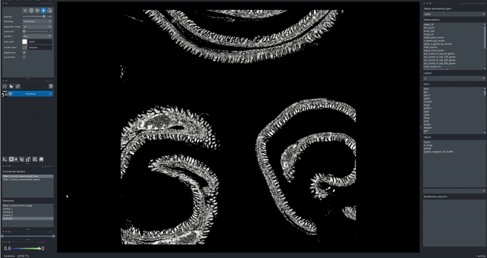

# napari-spatialdata-dea
A napari plugin for differential expression analysis between regions of interest

 


> [!NOTE] 
> napari-spatialdata-dea [documentation](https://napari-spatialdata-dea.readthedocs.io/en/latest/
) will be online soon! 


### Quick start

To install napari-spatialdata-dea, run the following command.
Make sure you have both [spatialdata and napari-spatialdata](https://spatialdata.scverse.org/en/latest/installation.html) installed in the same environment
```
pip install https://github.com/Yasas1994/napari-spatialdata-dea.git@main
```

### How to use this plugin?
First, [define your regions of interests (rois)](https://spatialdata.scverse.org/en/latest/tutorials/notebooks/notebooks/examples/napari_rois.html) Shapes layers in napari and drawing on them.
Each Shapes layer can contain multiple ROIs.Then, launch the napari-spatialdata-dea plugin, select the two ROIs you want to compare, and run the differential expression analysis.
You can double-click genes in the results table to color the points in the viewer according to their expression levels.

